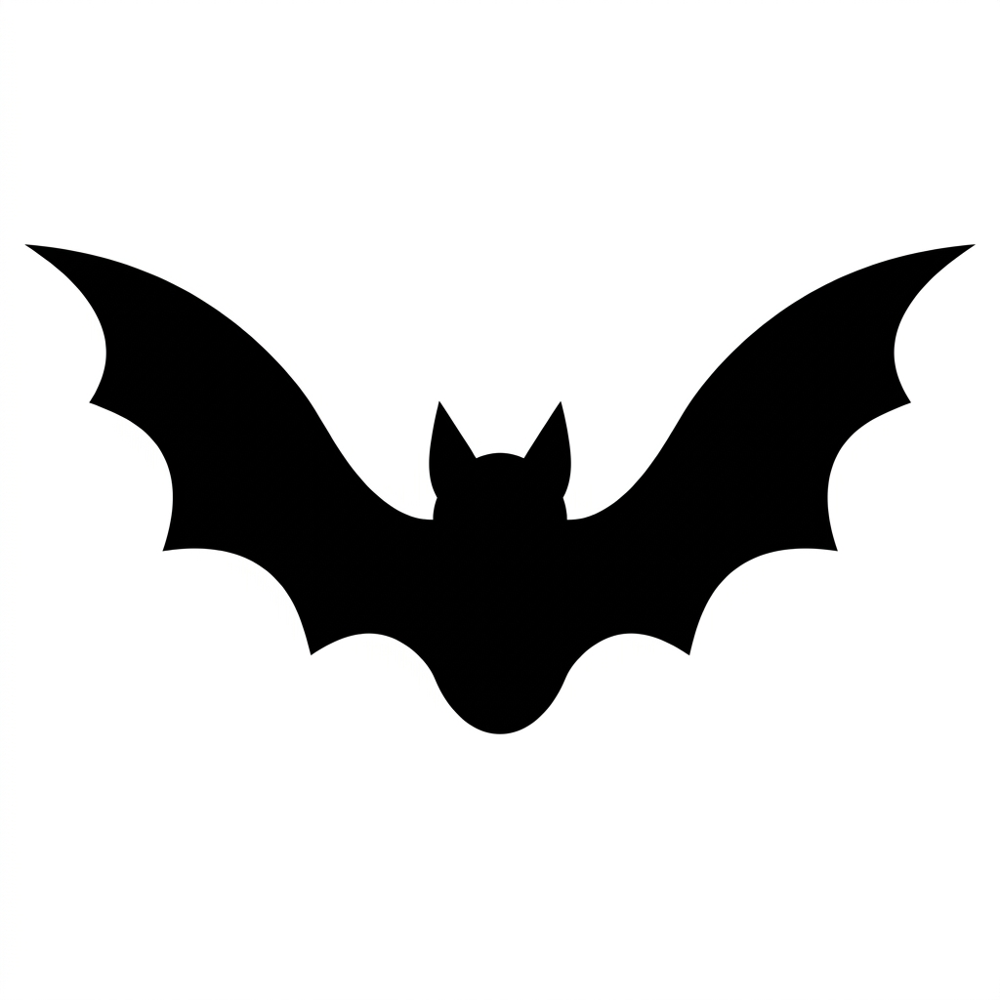

  
  <h1>HallowNet</h1>
  
<strong>The ultimate Chromium-based browser for Halloween, horror, and autumn enthusiasts.</strong>

---

## 🎃 What is HallowNet?
HallowNet is a fully custom, heavily themed desktop web browser built from the ground up using Electron and React. It is designed to immerse you in a spooky, atmospheric browsing experience complete with ambient weather effects, ghostly tutorials, and a completely custom UI that ditches the boring standard browser look.

## 🦇 Core Features

*   **Custom React Installer:** HallowNet bypasses standard boring Windows installers for a fully custom, beautifully animated installation experience.
*   **The Crypt (Password Manager):** A secure, encrypted local vault to store your credentials.
*   **Atmospheric Themes:** Choose from custom built-in themes like *Classic Halloween*, *Blood Moon*, *Geesebimps*, and *Ectoplasm*, or build your own from scratch using the interactive Theme Creator!
*   **Ghost Mode & The Gargoyle:** A heavily customized private browsing mode protected by a watchful Gargoyle that bypasses standard tracking.
*   **The Trapdoor (Panic Button):** Hit a global hotkey to instantly slam shut your browsing session with an explosive animation and sound effect, hiding your tracks.
*   **Poltergeist Macros:** Record your mouse movements, clicks, and typing, and play them back to automate your browsing.
*   **Ambient Audio Engine:** Listen to dynamic, looping thunderstorms and autumn winds while you browse.
*   **Seamless Auto-Updater:** Silently pings GitHub for new updates and beautifully integrates with the custom installer.

## 🛠️ Architecture

HallowNet is built on a modern stack tailored for performance and extreme UI flexibility:
*   **Framework:** React 18 & Vite
*   **Desktop Engine:** Electron (Chromium & Node.js)
*   **Styling:** Custom CSS (No Tailwind) tailored for intense animations, gradients, and glassmorphism.
*   **Icons:** Lucide React

## 📜 Notice
This project is currently developed as a personal, custom desktop experience. The source code is provided as-is without a formal open-source license. All rights reserved by the original creator.
